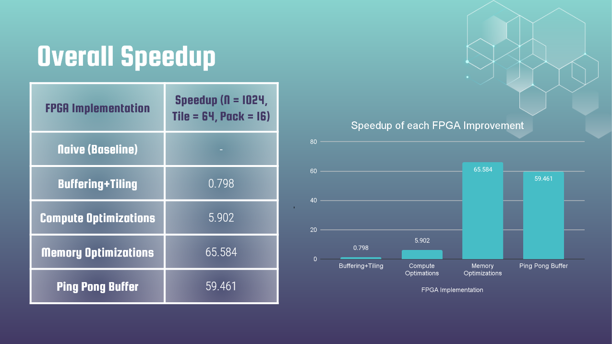

# FPGA Accelerated Gaussian Elimination Algorithm

This program provides a step-by-step optimization of the commonly used Gaussian Elimination algorithm.

## Results

We iteratively applied the following common optimizations and received the following speedup results:

| FPGA Implementation   | Speedup (n = 1024, Tile = 64, Pack = 16) |
| --------------------- | ---------------------------------------- |
| Native (Baseline)     | 1                                        |
| Buffering + Tiling    | 0.798                                    |
| Compute Optimizations | 5.902                                    |
| Memory Optimizations  | 65.584                                   |
| Ping Pong Buffer      | 59.461                                   |



## Prerequisites

- Xilinx Vitis 2020.2
- cuda 11.0

## Usage

### Running Individual Optimizations

To run the individual optimizations seperately, first navigate to the corresponding folder using the Vitis HLS command prompt:

> i.e. for the memory optimization run navigate to:

```
$ cd fpga/mem-opt/
```

Run the run_hls.tcl script using the following command:

```
$ vitis_hls -f run_hls.tcl
```

Note: The hierarchy for optimizations are as follows:

1. Buffering + Tiling
2. Compute Optimizations
3. Memory Optimizations
4. Ping Pong Buffer

> i.e. The Ping Pong Buffer optimization introduces the new memory access pattern in additon to all previous optimizations

### FPGA run and emulation

To execute the FPGA run and emulation, first navigate to the respective hw-emu or hw-run folder.

Then, use the provided make file for the respective run/emulation:

> i.e. Use either:

```
$ make run TARGET=hw
```

> or

```
$ make run TARGET=hw_emu
```

Ensure you clean the build after each run:

```
$ make cleanall
```

## Future Development

Our current implementation suffers from a slowdown when the ping-pong buffer optimization is applied. We should in theory be able to receive a significant performance increase if we can fix this implementation and sufficiently leverage the FPGA resource utilization. Currently, the resource utilization is around 1-18%.

## Acknowledgements

- The cuda code is provided from the [Rodinia GPU Benchmark suite](http://lava.cs.virginia.edu/Rodinia/download_links.html)
- The FPGA base code is provided from the OpenMP implementation from [gaussian-elimincation-pthreads-openmp](https://github.com/gmendonca/gaussian-elimination-pthreads-openmp)
- Makefiles are provided courtesy of Xilinx
